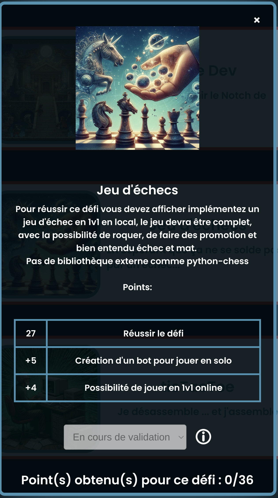
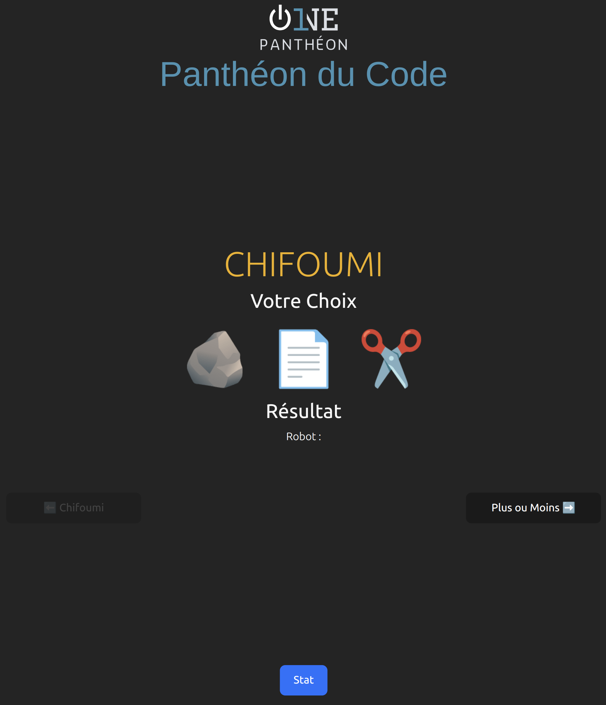
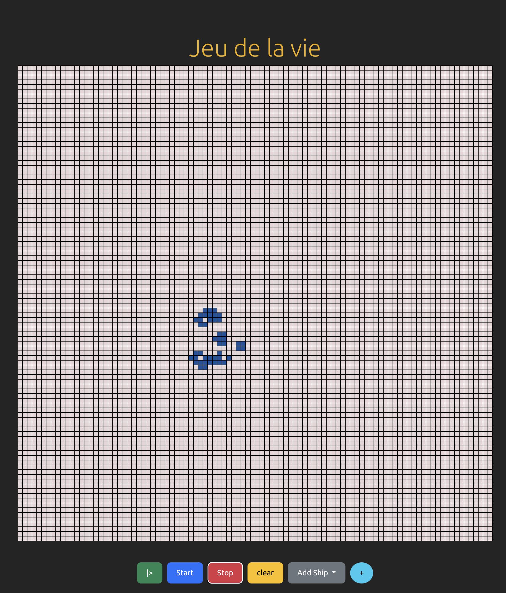
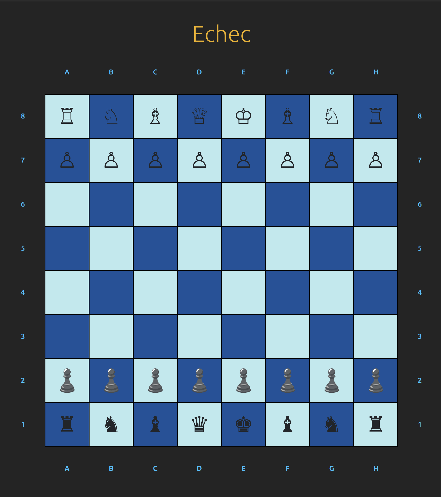

# Chifoumi et Plus ou moins et  Jeu de la vie  #Poc_1P
---

| <a href="https://poc.onepantheon.fr/html/defi.html"></a> | <a href="https://poc.onepantheon.fr/html/defi.html"></a> | <a href="https://poc.onepantheon.fr/html/defi.html"></a> |<a href="https://poc.onepantheon.fr/html/defi.html"></a>

# Installation 

- Cloner le repo

- Installer [Node.js](https://nodejs.org/fr/download/package-manager)

- Aller dans le fichier [Defis2et3](https://github.com/Corentin-k/pantheonDuCode/archive/refs/heads/main.zip)

- Click droit --> Ouvrir le dossier dans un terminal


```bash
npm i
```
# Pour lancer le site

```bash
npm run dev
```

---






