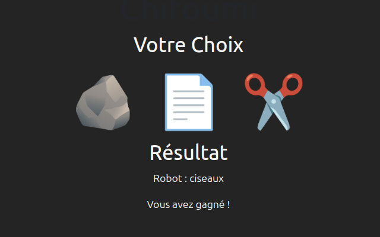
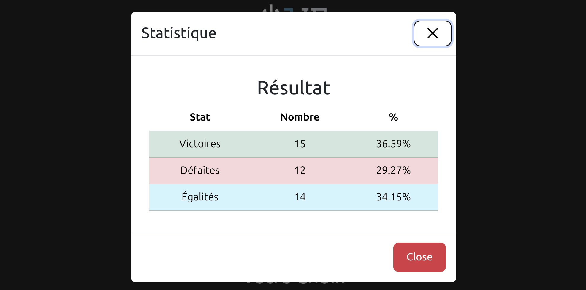
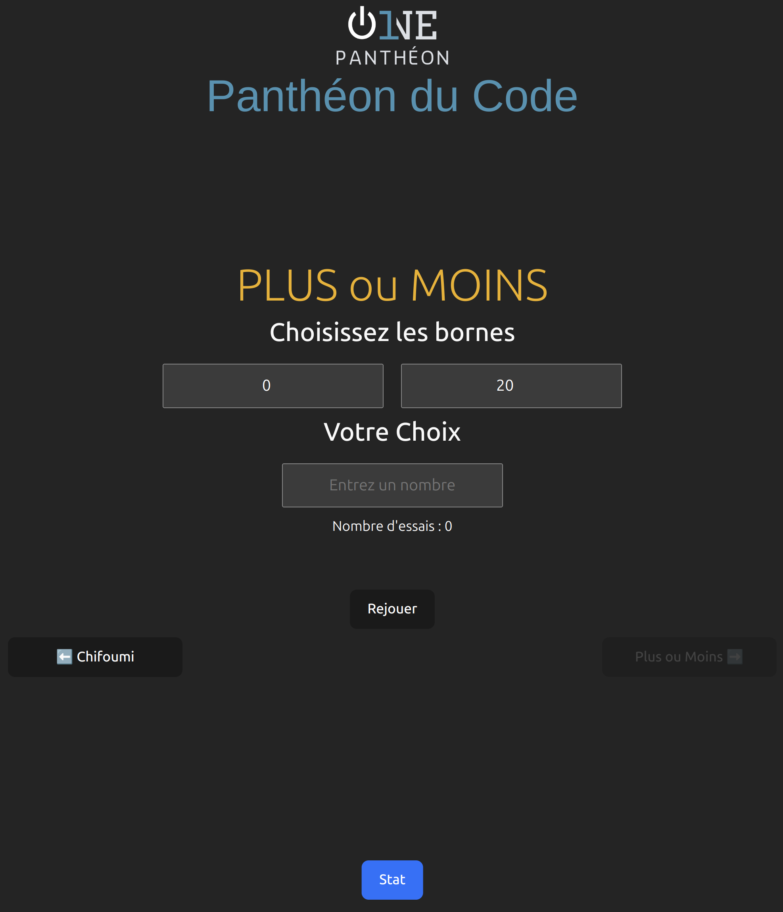

# DEFIS 2 et 3
##  Chifoumi et Plus ou moins 

# installation 

- Cloner le repo

- Installer Node.js

- Aller dans le fichier Defis2et3

- Click droit --> Ouvrir le dossier dans un terminal


```bash
npm i
```
# Pour lancer le site

```bash
npm run dev
```





